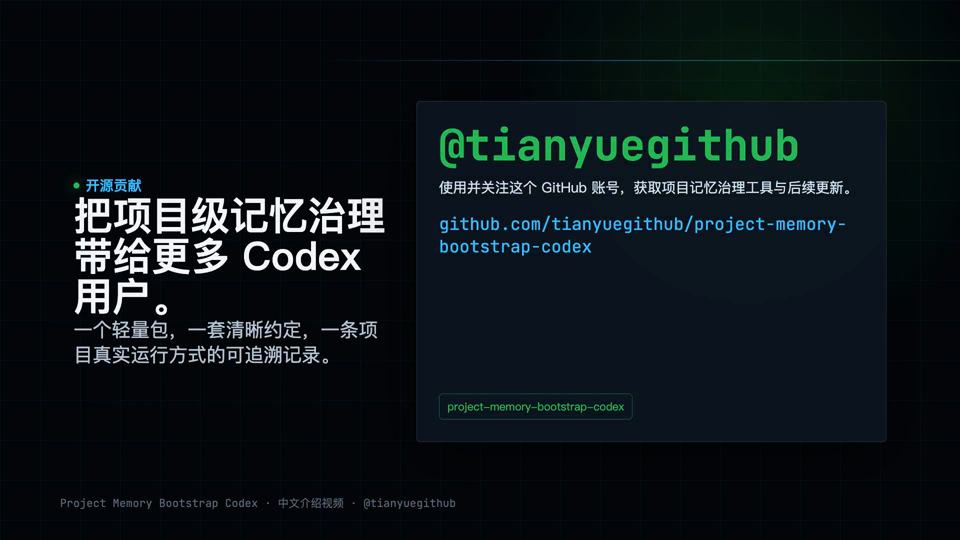
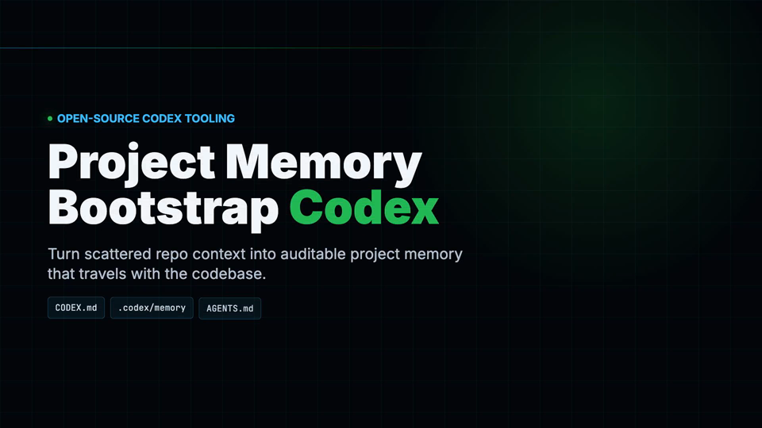

# Project Memory Bootstrap Codex

非官方社区项目。它为 OpenAI Codex 增加一层“项目级可治理记忆”，用于把项目事实、运行入口、脚本知识、当天事件和长期规则沉淀在仓库内。

## 视频介绍

### 中文版（带配音）

[](https://cdn.jsdelivr.net/gh/tianyuegithub/project-memory-bootstrap-codex@main/docs/videos/project-memory-bootstrap-codex-intro-zh.mp4)

点击封面即可播放 [中文版 MP4](https://cdn.jsdelivr.net/gh/tianyuegithub/project-memory-bootstrap-codex@main/docs/videos/project-memory-bootstrap-codex-intro-zh.mp4)，视频文件保存在本仓库。

### English with voiceover

[](https://cdn.jsdelivr.net/gh/tianyuegithub/project-memory-bootstrap-codex@main/docs/videos/project-memory-bootstrap-codex-intro-en.mp4)

Click the cover to play the [English MP4](https://cdn.jsdelivr.net/gh/tianyuegithub/project-memory-bootstrap-codex@main/docs/videos/project-memory-bootstrap-codex-intro-en.mp4). The video file is stored in this repository.

## 它解决什么问题

原生 Codex 已经有两类能力：

- `AGENTS.md`: 项目或目录级 instruction，适合写“在这个仓库里怎么工作”。
- Codex Memories: 可选开启的跨会话长期记忆，适合记录个人偏好、历史经验和稳定工作流。

但原生机制不天然提供严格的项目级记忆治理，例如：

- 每次进入项目先初始化项目记忆。
- 把“第一眼项目说明书”“长期事实”“当天事件”分层保存。
- 为长期记忆记录来源、最近核验、稳定性、失效条件。
- 明确事实来源优先级、晋升规则、冲突处理和脚本治理规则。
- 将项目知识随仓库一起审计、复用和开源。

本项目补齐的就是这一层。

## 核心文件

```text
CODEX.md
.codex/memory/MEMORY.md
.codex/memory/YYYY-MM-DD.md
```

- `CODEX.md`: 项目第一眼说明书，只放首屏级事实和索引。
- `.codex/memory/MEMORY.md`: 长期记忆，只收录已核验、可跨任务复用、3 天后仍大概率成立的事实。
- `.codex/memory/YYYY-MM-DD.md`: 当天事件日志，记录发现、验证、决策、迁移、冲突和待回验事项。

## 快速开始

从源码安装：

```bash
pip install -e .
```

初始化当前项目：

```bash
project-memory-bootstrap-codex init .
```

同时生成 `AGENTS.md`：

```bash
project-memory-bootstrap-codex init . --with-agents
```

检查项目记忆是否完整：

```bash
project-memory-bootstrap-codex doctor .
```

扫描关键 shell 脚本：

```bash
project-memory-bootstrap-codex scan-scripts .
```

## Codex skill

仓库内包含一个可安装的 Codex skill：

```text
skills/project-memory-bootstrap-codex/
```

可以把它复制到你的 Codex skills 目录，或作为团队模板随项目分发。它的职责是指导 Codex 在进入项目时执行项目记忆初始化协议。

## 目录结构

```text
project-memory-bootstrap-codex/
├── src/project_memory_bootstrap_codex/   # Python CLI
├── templates/                            # AGENTS.md / CODEX.md / memory 模板
├── skills/project-memory-bootstrap-codex/
├── docs/                                 # 设计说明和采用指南
└── tests/                                # 单元测试
```

## 设计原则

1. 原生优先：不替代 Codex 原生 `AGENTS.md` 和 Memories。
2. 仓库内可审计：项目事实跟随仓库，而不是只留在聊天上下文。
3. 证据优先：没有源码、配置、脚本、测试或用户确认，不晋升为长期记忆。
4. 分层治理：`CODEX.md` 放摘要，`MEMORY.md` 放长期细节，当天文件放事件。
5. 不盲目覆盖：CLI 默认不覆盖已有文件。

## 安全说明

- CLI 只扫描 shell 脚本路径，不执行脚本。
- CLI 不访问网络，不读取密钥管理器，不上传项目内容。
- `--force` 只在写入目标解析后仍位于项目根目录内时才覆盖托管文件，避免符号链接把写入导向仓库外。
- 开源或提交项目前，仍应人工审查 `.codex/memory/*`，避免把原项目内部摘要、客户信息或密钥片段写入仓库。

## License

MIT
